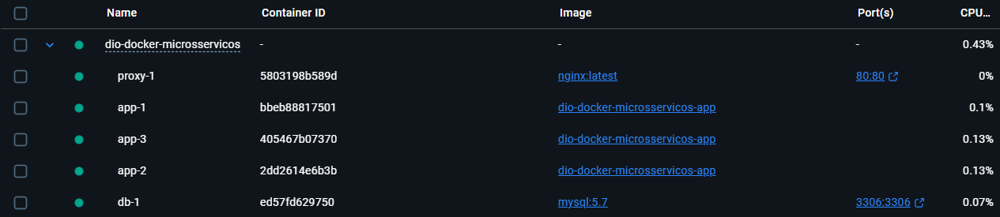

# DIO - Microsserviços com Docker

Projeto desenvolvido para o bootcamp da DIO. Arquitetura simples de microsserviços com balanceamento de carga e conteinerização.

## 🛠️ Tecnologias

- **Java 21** (Spring Boot)
- **MySQL**
- **Nginx** (Load Balancer)
- **Docker** e **Docker Compose**


## ▶️ Como Executar


1. Clone o repositório:
   ```bash
   git clone https://github.com/lucaspmntl/dio-docker-microservices.git
   ```

2. Na pasta raiz, execute:
   ```bash
   docker-compose up -d --build
   ```

3. Acesse no navegador: [http://localhost](http://localhost)

> **Observação:** Ao atualizar a página (F5), você verá o Nginx alternando entre os containers que tratam a requisição, demonstrando o balanceamento de carga.

## ⏹️ Como Parar

```bash
docker-compose down
```